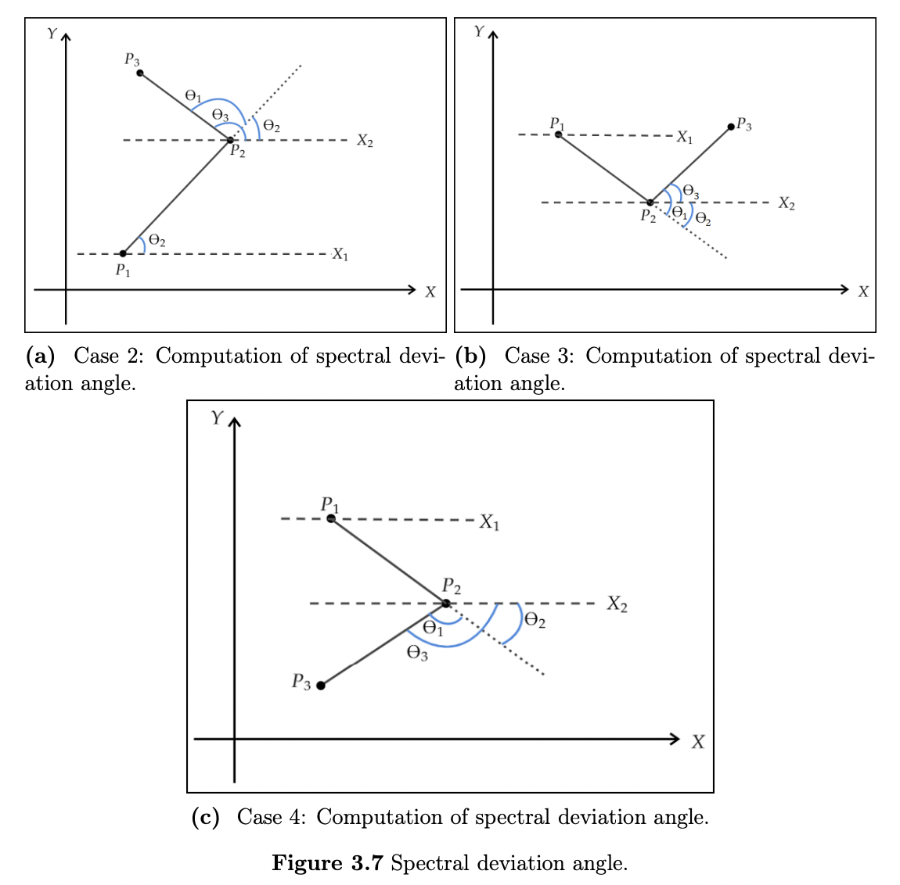
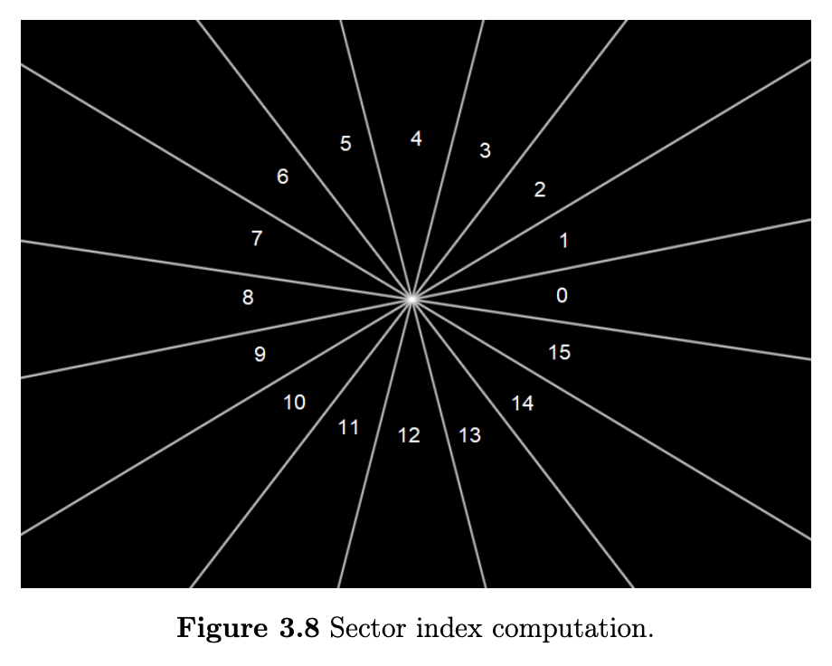

#### Computing some features in Fourier space - could be used as experimental features while working with images


```python
# Libraries import
import numpy as np
import math
import os
import cmath
```


```python
# Length of square 2D sample
N = 256
```

#### Compute spectral rotation angle given r, c (real and complex parts)


```python
# Compute spectral rotation angle given r,c
def spectral_rotation_angle(r, c):
    x = r - (N / 2)
    y = (N / 2) - c
    q = 0 if x == 0 or y == 0 else (y / x)
    phase = math.atan(q)
    return phase
```

#### Computing spectral deviation angle




```python
# Computing spectral deviation angle
def compute_spectral_deviation_angle(p1, p2, p3):
    # p1(x1,y1)
    # p2(x2,y2)
    # p3(x3,y3)
    HX1 = []
    HX2 = []
    
    HX1.append(p1[0]-5) # x1 0
    HX1.append(p1[1]) # y1 1
    HX1.append(p1[0]+5) # x2 2
    HX1.append(p1[1]) # y2 3
    
    HX2.append(p2[0]-5)
    HX2.append(p2[1])
    HX2.append(p2[0]+5)
    HX2.append(p2[1])
    
    M1 = (HX1[3]-HX1[1])/(HX1[2]-HX1[0]) # Slope of HX1
    M2 = (p2[1]-p1[1])/(p2[0]-p1[0]) # Slope of p1p2
    M3 = (HX2[3]-HX2[1])/(HX2[2]-HX2[0]) # Slope of HX2
    M4 = (p3[1]-p2[1])/(p3[0]-p2[0]) # Slope of p2p3
    
    TAN1 = abs((M2-M1)/(1+M1*M2))
    THETA1 = math.atan(TAN1)
    
    TAN2 = abs((M4-M3)/(1+M3*M4))
    THETA2 = math.atan(TAN2)
    
    # For negative slope, THETA1 is negative
    if M2 < 0:
        THETA1 = -THETA1
        
    if p3[1] < p2[1]:
        THETA2 = -THETA2
    
    THETA3 = THETA2-THETA1
    
    #OBJ.append(THETA3)
    
    return THETA3
```

#### Compute sector index




```python
# Compute sector index
def compute_sector(r, c):
    phase = math.atan(r/c)
    phase_d = abs(np.degrees(phase))
    #print(phase_d)
    v = (phase_d/22.5)//1 #get only integer
    if v == 16:
        return 0
    return v
```

#### Compute distance given r, c


```python
# Compute distance given r,c
def compute_distance(r, c):
    x = r - (N / 2)
    y = (N / 2) - c
    d = math.sqrt(x*x+y*y)
    return d
```

#### Function call with dummy values


```python
# F(u) = Re(u) + i · Im(u) 
z = 5+3j
# Print the parts of Complex No.
print("The real part of complex number is : ", end="")
print(z.real)
 
print("The imaginary part of complex number is : ", end="")
print(z.imag)

r, c = z.real, z.imag

output = spectral_rotation_angle(r, c)
print(f'spectral rotation angle = {output}')

output = compute_spectral_deviation_angle([1,3], [2,3], [1,4])
print(f'spectral deviation angle = {output}')

output = compute_sector(r, c)
print(f'sector index = {output}')

output = compute_distance(r, c)
print(f'distance = {output}')
```

    The real part of complex number is : 5.0
    The imaginary part of complex number is : 3.0
    spectral rotation angle = -0.7934625047042153
    spectral deviation angle = 0.7853981633974483
    sector index = 2.0
    distance = 175.3681841155915

